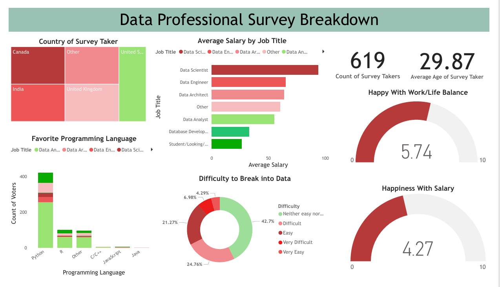

# Data Professional Survey Breakdown

This project provides insights into the experiences and preferences of data professionals across various roles and industries. The dataset analyzed represents responses from 619 survey participants. The data was thoroughly cleaned in **Power BI** using **Power Query** for data transformation and **DAX functions** to create calculated columns and measures. The visualizations help uncover trends in salary, programming language preferences, work-life balance, and the challenges faced in breaking into the data field.

---
## Survey Questions

The dataset is based on a survey with the following questions:

1. **Which Title Best Fits your Current Role?**
2. **Did you switch careers into Data?**
3. **What is your current yearly salary (in USD)?**
4. **What industry do you work in?**
5. **What is your favorite programming language?**
6. **How happy are you in your current position with the following?**
   - Salary
   - Work/Life Balance
   - Coworkers
   - Management
   - Upward Mobility
   - Learning New Things
7. **How difficult was it for you to break into Data?**
8. **If you were to look for a new job today, what would be the most important thing to you?**
9. **What is your gender?** (Male/Female)
10. **What is your current age?**
11. **Which country do you live in?**
12. **What is your highest level of education?**
13. **What is your ethnicity?**

---

## Tools Used

- **Power BI**: For data visualization, cleaning, and transformation.
- **Power Query**: Used for data transformation and cleaning.
---

## Visualizations

The dashboard provides an interactive summary of:
- **Country distribution of survey takers** (tree map).
- **Average salary by job title** (clustered bar chart).
- **Favorite programming languages** (bar chart).
- **Difficulty in breaking into data** (donut chart).
- **Happiness levels with work-life balance and salary** (gauge charts).
  
---

## Key Insights

1. **Country of Survey Takers**:
   - The majority of respondents are from the **United States**, with notable representation from **Canada**, **India**, and the **United Kingdom**.

2. **Average Salary by Job Title**:
   - **Data Scientists** report the highest average salary, followed by **Data Engineers** and **Data Architects**. Entry-level roles such as **Database Developers** have comparatively lower earnings.

3. **Favorite Programming Languages**:
   - **Python** is the most popular programming language across all job roles, significantly outperforming others such as **R**, **JavaScript**, and **C/C++**.

4. **Happiness Levels**:
   - Respondents rated their satisfaction with **work-life balance** slightly higher (average: 5.74/10) than with **salary** (average: 4.27/10).

5. **Difficulty in Breaking into Data**:
   - A significant portion of participants found the process of breaking into the data field "neither easy nor difficult," though a notable minority described it as "very difficult."
---

## Limitations
   - Survey responses may include biases or inaccuracies due to self-reporting.
   - Some fields were generalized or grouped for analysis, which might oversimplify nuanced data points.
   - Various responses in the dataset were grouped under "Others" for simplicity.

